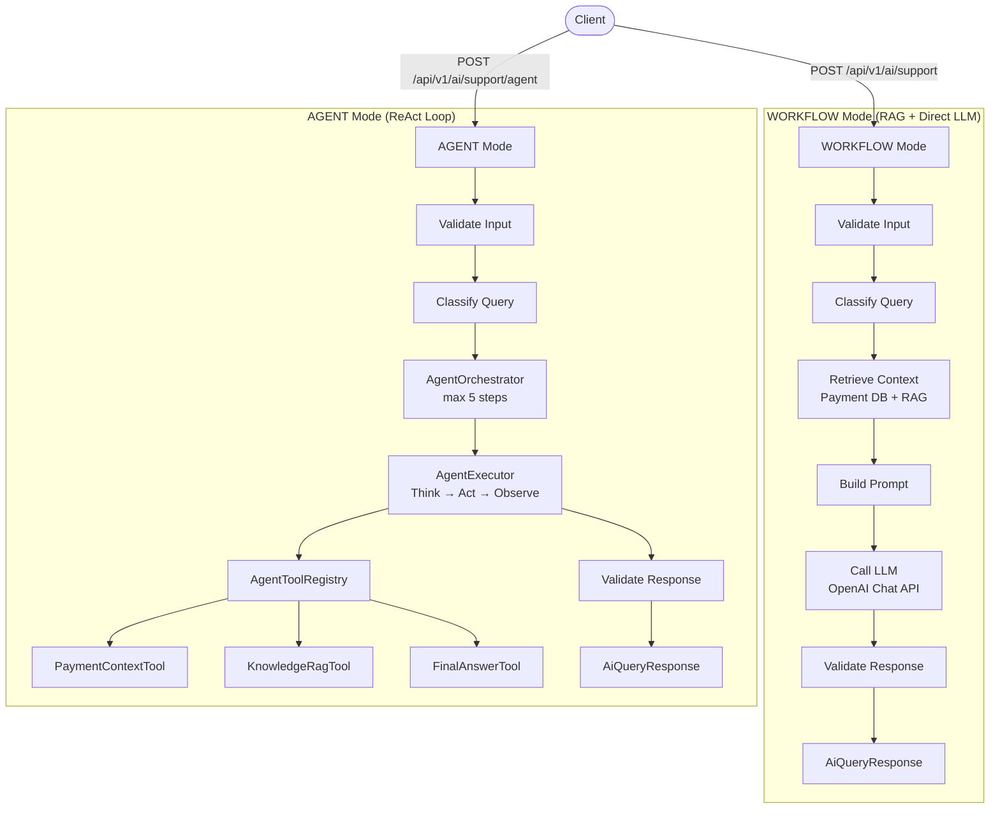

# Payment Microservice – Cloud Native Spring Boot Application with AI support
# Event-Driven Architecture with Kafka, Redis, and RAG-based AI Support (Agent + Workflow)

Java | Spring Boot | Kafka | REST API | JWT Security | Resilience4j | Azure | Kubernetes | Docker | CI/CD | Design Patterns | AI / RAG / Agent / LLM

---

# Overview

This repository contains a cloud-native Payment microservice built using Spring Boot and designed for deployment on Microsoft Azure.

The project simulates a production-grade payment processing system and demonstrates how modern backend systems are built using:

- Secure REST APIs with JWT authentication

- Event-driven architecture using Apache Kafka

- Transaction reliability using the Transactional Outbox Pattern

- Idempotent request handling to prevent duplicate payments

- Fault tolerance using Resilience4j (Circuit Breaker & Retry)

- Redis-based Token Bucket rate limiting to control API traffic and prevent abuse

- Containerization using Docker and orchestration via Kubernetes

- CI/CD pipelines using Azure DevOps

- **AI-powered customer support** using RAG (Retrieval-Augmented Generation) and a ReAct-style LLM agent loop — integrated directly into the payment service to answer user queries about transactions, failures, and refunds using OpenAI GPT-4o

This project reflects real-world enterprise backend architecture used in banking and fintech systems, extended with a practical AI support layer that combines vector search, prompt engineering, safety guardrails, and autonomous tool-calling agents.

---

# Architecture

```mermaid
flowchart TD

    %% ================= CLIENT =================
    A[Client / Frontend] --> B[Spring Boot Payment Service]

    %% ================= CORE PAYMENT FLOW =================
    subgraph CORE["Core Payment Processing"]
        B --> RL["Redis Rate Limiter<br/>Token Bucket"]
        RL -->|Allowed| AUTH["JWT Authentication"]
        RL -->|Rejected| ERR[429 Too Many Requests]

        AUTH --> CTRL[REST Controllers]
        CTRL --> SVC[Service Layer]

        SVC --> IDEMP[Idempotency Check]
        IDEMP -->|Duplicate| CACHE[Return Cached Response]
        IDEMP -->|New| TXN[Process Payment]

        TXN --> DB[(SQL Database)]
        TXN --> OUTBOX[Transactional Outbox]

        OUTBOX --> KP[Kafka Producer]
        KP --> TOPIC["Kafka Topic: payment.created"]

        TOPIC --> KC[Kafka Consumer]
        KC --> DOWNSTREAM[Notification / Audit Services]

        SVC --> CB[Resilience4j Circuit Breaker]
        SVC --> RT[Resilience4j Retry]
    end

    %% ================= AI ENTRY =================
    B --> AICTRL["AI Support Controller<br/>/ai/support & /ai/support/agent"]

    %% ================= WORKFLOW MODE =================
    subgraph WF["AI WORKFLOW Mode (Deterministic RAG Pipeline)"]
        AICTRL --> V1[Validate Request]
        V1 --> SAFE1[Prompt Safety Check]
        SAFE1 --> QC1[Query Classification]

        QC1 --> PCR[Fetch Payment Context]
        PCR --> DB

        QC1 --> RAG[RAG Retrieval]
        RAG --> EMB[Embedding Service]
        EMB --> VS[Vector Store]

        PCR --> PB[Prompt Builder]
        RAG --> PB

        PB --> LLM1[LLM Call (OpenAI)]
        LLM1 --> RV1[Response Validation]
        RV1 --> RESP1[AI Response]
    end

    %% ================= AGENT MODE =================
    subgraph AG["AI AGENT Mode (ReAct Loop)"]
        AICTRL --> V2[Validate Request]
        V2 --> SAFE2[Prompt Safety Check]
        SAFE2 --> QC2[Query Classification]

        QC2 --> ORCH[Agent Orchestrator]
        ORCH --> EXEC[Agent Executor<br/>Think → Act → Observe]

        EXEC --> TOOLREG[Tool Registry]

        TOOLREG --> T1[Payment Context Tool]
        T1 --> DB

        TOOLREG --> T2[Knowledge RAG Tool]
        T2 --> EMB
        T2 --> VS

        TOOLREG --> T3[Final Answer Tool]

        T3 --> RV2[Response Validation]
        RV2 --> RESP2[AI Response]
    end

    %% ================= DEPLOYMENT =================
    subgraph CLOUD["Cloud & Deployment"]
        GIT[GitHub]
        CI[Azure DevOps CI/CD]
        DOCKER[Docker]
        K8S[Kubernetes / AKS]
        APP[Azure App Service / AKS]
        MON[Application Insights]
    end

    GIT --> CI --> DOCKER --> K8S --> APP
    B --> MON
```

---

# Tech Stack

Backend

- Java 21
- Spring Boot 3
- Spring Web
- Spring Data JPA
- Spring Security

AI / LLM

- OpenAI Chat Completions API (`gpt-4o`)
- OpenAI Embeddings API
- RAG (Retrieval-Augmented Generation)
- ReAct Agent Loop (Think → Act → Observe)
- Cosine Similarity Vector Search

Messaging

- Apache Kafka
- Kafka Producer & Consumer APIs

Resilience

- Resilience4j (Circuit Breaker, Retry)

Caching & Rate Limiting

- Redis (Token Bucket Algorithm)

Cloud

- Microsoft Azure
- Azure App Service

Containerization & Orchestration

- Docker
- Kubernetes

DevOps

- Azure DevOps Pipelines
- Infrastructure as Code (Bicep)

Monitoring

- Azure Application Insights
- Azure Log Analytics

---

# Key Features

1. Secure REST APIs (JWT Authentication)

- Stateless authentication using JWT
- Token-based authorization for protected endpoints
- Spring Security filter chain implementation

2. Event-Driven Architecture (Kafka)

- Payment creation triggers an event → payment.created topic
- Producer publishes events reliably
- Consumer processes downstream workflows asynchronously

Benefits:
- Loose coupling
- Scalability
- High throughput

3. Transactional Outbox Pattern
Ensures reliable message delivery without data inconsistency.

Flow:
- Payment saved in DB
- Event stored in Outbox table
- Outbox publisher sends event to Kafka
- Event marked as processed

Why?
- Prevents data loss between DB & Kafka
- Ensures exactly-once behavior (practical)

4. Idempotent Request Handling
Prevents duplicate payment processing.
- Unique request ID (idempotency key)
- Duplicate requests return cached response
- Ensures safe retries from clients

5. Fault Tolerance (Resilience4j)
Circuit Breaker
- Prevents cascading failures
- Opens when downstream service fails repeatedly
Retry Mechanism
- Retries transient failures automatically
Result:
- Improved system stability
- Better user experience

6.Rate Limiting (Redis – Token Bucket Algorithm)

Implemented Redis-based Token Bucket rate limiting to control API traffic and prevent abuse.

How it works:
- Each client is assigned a token bucket
- Tokens are refilled at a fixed rate
- Each API request consumes a token
- Requests are rejected when tokens are exhausted

Why Token Bucket?
- Allows short bursts of traffic
- Ensures steady request rate over time
- Better suited for payment systems compared to fixed window limits

Benefits:
- Protects system from overload
- Prevents abuse and DDoS-like traffic
- Maintains consistent API performance under high load

---

# Security Architecture

Authentication Flow:

Client Request
↓
Authentication Controller
↓
JWT Token Generation
↓
Client Stores Token
↓
Request with Authorization Header
↓
JWT Filter Validation
↓
Access Granted

Header Example:

Authorization: Bearer <JWT_TOKEN>

---

# API Endpoints

Authentication

POST /auth/login

Request:

{
  "username": "user",
  "password": "password"
}

Response:

{
  "token": "JWT_TOKEN"
}

Payment APIs

GET /payments
POST /payments

Requires JWT Token

Triggers Kafka event on creation 

---
## Project Structure

```plaintext
payment-service
│
├── src/main/java/com/example/payment
│   ├── controller        → REST API endpoints
│   ├── service           → Business logic layer
│   ├── repository        → Data access (JPA)
│   ├── entity            → Database entities
│   ├── dto               → Request/Response objects
│   ├── exception         → Global exception handling
│   ├── util              → Utility classes (JWT, helpers)
│   ├── config            → Security, Kafka, Resilience configs, RateLimitConfigs 
│
│   ├── messaging         → Kafka producer & consumer
│   ├── event             → Event models (PaymentCreatedEvent)
│   ├── outbox            → Transactional Outbox implementation
│   ├── idempotency       → Idempotency handling logic
│
│   ├── ai                → AI Support Module (RAG + Agent)
│   │   ├── agent         → ReAct agent loop (orchestrator, executor, registry, state)
│   │   ├── classifier    → Keyword-based query classifier
│   │   ├── config        → LlmProperties, AiConfig (RestClient bean)
│   │   ├── controller    → AiSupportController (two endpoints)
│   │   ├── dto           → AiQueryRequest/Response, PaymentContextDto, etc.
│   │   ├── exception     → ValidationException, AiProcessingException, etc.
│   │   ├── llm           → LlmClient interface, OpenAiLlmClient, parser, mapper
│   │   ├── mapper        → PaymentContextMapper, LlmResponseMapper
│   │   ├── model         → QueryType, LlmResponse, InternalAiResponse, RagChunk, etc.
│   │   ├── prompt        → SystemPrompts, PromptTemplates, PromptBuilder
│   │   ├── rag           → DocumentChunker, EmbeddingService, VectorStoreService, RagRetriever
│   │   ├── retriever     → PaymentContextRetriever
│   │   ├── service       → AiSupportService
│   │   ├── tool          → AgentTool interface, PaymentContextTool, KnowledgeRagTool, FinalAnswerTool
│   │   ├── validator     → AiRequestValidator, PromptSafetyValidator, AiResponseValidator, ResponseSafetyValidator
│   │   └── workflow      → AiWorkflowEngine, AiWorkflowContext, AiWorkflowStep, AiWorkflowResult
│
│   ├── strategy          → Strategy pattern
│   ├── factory           → Factory pattern
│   ├── decorator         → Decorator pattern
│   ├── observer          → Observer pattern
│   ├── proxy             → Proxy pattern
│   ├── template          → Template pattern
│
│   └── PaymentApplication.java
│
├── src/main/resources
├── src/test/java/com/example/payment
├── k8s/
├── infra/
├── Dockerfile
├── docker-compose.yml
├── pom.xml
├── azure-pipelines.yml
└── README.md
```

# Design Patterns Implemented
- Strategy Pattern → Payment processing logic
- Factory Pattern → Processor creation
- Decorator Pattern → Additional behaviors
- Observer Pattern → Event notifications
- Proxy Pattern → Controlled access
- Template Pattern → Workflow standardization

---
# Docker

Build:
docker build -t payment-service .

Run:
docker run -p 8080:8080 payment-service

---

# Kubernetes Deployment
kubectl apply -f k8s/

Includes:

Deployment

Service

Namespace

Secrets

---
# Azure Deployment

Azure App Service

CI/CD via Azure DevOps

Flow:
Code → Build → Docker → Deploy

---
# Running Locally
mvn clean install
mvn spring-boot:run

URL:
http://localhost:8080

---
# Skills Demonstrated

- Java & Spring Boot backend engineering
- Microservices & REST API design
- Kafka event-driven architecture
- Transactional Outbox Pattern
- Idempotency handling
- Fault tolerance (Resilience4j)
- Rate limiting using Redis (Token Bucket Algorithm)
- Docker & Kubernetes
- Azure cloud deployment
- CI/CD pipelines
- LLM integration (OpenAI Chat Completions + Embeddings APIs)
- RAG pipeline design (chunking, embedding, vector search, retrieval)
- ReAct agent loop with tool registry and dynamic tool discovery
- Prompt engineering (system prompts per query type, safety validators, PII detection)
- AI safety & guardrails (prompt injection detection, response sanitization)

---

# Why This Project Matters

This project demonstrates how real-world financial systems are built with:

- Reliability
- Scalability
- Fault tolerance
- Secure communication

It mirrors architecture used in:

-Banking systems
-Payment gateways
-Distributed microservices

---

# Improvements / Future Enhancements

Planned next-level improvements:

Architecture Enhancements

- Introduce Saga Pattern (Orchestration/Choreography)
- Add Dead Letter Queue (DLQ) for Kafka
- Implement Event versioning & schema registry

Observability

- Distributed tracing (OpenTelemetry / Zipkin)
- Centralized logging (ELK stack)
- Metrics dashboard (Prometheus + Grafana)

Performance & Scalability

- Kafka partition tuning
- Horizontal pod autoscaling (HPA)
- Redis caching layer

Security

- OAuth2 integration
- Role-based access control (RBAC)
- API rate limiting

Testing

- Contract testing
- Integration testing with Testcontainers
- Chaos engineering

AI Enhancements

- Swap in-memory vector store for pgvector / Pinecone / Weaviate
- Add conversation memory (session-scoped message history)
- Stream LLM responses via Server-Sent Events (SSE)
- Add feedback loop (thumbs up/down → fine-tuning data)
- Multi-turn agent sessions with persistent AgentState
- Evaluation harness for RAG retrieval quality (MRR, NDCG)

---

---

# AI Support Module

The payment service includes a production-grade AI customer support module (`com.example.payment.ai`) that answers user questions about their payments using two distinct execution modes: a direct **WORKFLOW** mode and a reasoning **AGENT** mode.

---

## AI Architecture Overview



---

## Two Execution Modes

### WORKFLOW Mode
A deterministic pipeline that always runs the same steps in order:

| Step | Component | Description |
|------|-----------|-------------|
| 1 | `AiRequestValidator` | Null checks, max 1 000 chars, userId required |
| 2 | `PromptSafetyValidator` | Blocks prompt injection ("ignore previous instructions", jailbreak, DAN, etc.) |
| 3 | `QueryClassifier` | Maps query to `QueryType` via keyword matching |
| 4 | `PaymentContextRetriever` | Fetches last 10 transactions from the DB for the user |
| 5 | `RagRetriever` | Embeds query → cosine similarity search → top-5 knowledge chunks |
| 6 | `PromptBuilder` | Assembles system prompt (per QueryType) + user prompt with context sections |
| 7 | `OpenAiLlmClient` | POSTs to OpenAI `/chat/completions`; mock mode returns a canned response |
| 8 | `LlmResponseMapper` | Maps raw JSON to `InternalAiResponse` |
| 9 | `AiResponseValidator` + `ResponseSafetyValidator` | Max 5 000 chars, no PII leak, no system-prompt leakage |

### AGENT Mode (ReAct)
A reasoning loop where the LLM decides which tool to call next:

```
AgentOrchestrator (max 5 steps)
  └── AgentExecutor.step()
        ├── Build step prompt  (tool descriptions + history + query)
        ├── Call LLM  → JSON {"tool": "...", "input": "..."}
        ├── AgentToolRegistry.get(toolName).execute(input)
        └── Record AgentObservation in AgentState.history
```

The loop ends when the LLM calls `final_answer` or the step limit is reached.

---

## RAG Pipeline

```
Raw Document
   └── DocumentChunker  (chunk size 500, overlap 50, sentence-boundary aware)
         └── EmbeddingService  (POST /embeddings → OpenAI | mock: zero vector)
               └── VectorStoreService  (ConcurrentHashMap, cosine similarity)
                     └── RagRetriever  (topK=5, minScore=0.7 → KnowledgeContextDto)
```

- **VectorStoreService** is swap-ready — replace the `ConcurrentHashMap` with pgvector, Pinecone, or Weaviate without changing any caller.
- **Cosine similarity** is computed in-process; production deployments should offload to the vector DB.

---

## LLM Layer

| Class | Responsibility |
|-------|---------------|
| `LlmClient` | Interface — `LlmResponse complete(systemPrompt, userPrompt)` |
| `OpenAiLlmClient` | Real implementation via `RestClient`; mock path returns UUID + canned text |
| `LlmResponseParser` | Parses raw JSON with Jackson into `LlmResponse` (choices, usage, finish reason) |
| `LlmResponseMapper` | Maps `LlmResponse` → `InternalAiResponse` (answer, tokens, finish reason) |
| `LlmProperties` | `@ConfigurationProperties(prefix="llm")` — apiKey, model, temperature, maxTokens, mockEnabled |

**Mock mode** (`llm.mock-enabled=true`) lets the entire pipeline run — including RAG, agent loop, and validators — without an API key. Flip to `false` and set `LLM_API_KEY` for real calls.

---

## Agent Tools

| Tool | `name()` | Description |
|------|----------|-------------|
| `PaymentContextTool` | `payment_context` | Fetches last 10 user transactions; returns JSON |
| `KnowledgeRagTool` | `knowledge_rag` | Runs RAG retrieval; returns joined excerpts |
| `FinalAnswerTool` | `final_answer` | Passes input straight through — signals loop completion |

New tools are auto-discovered: implement `AgentTool`, annotate with `@Component`, and `AgentToolRegistry` picks it up via Spring's `List<AgentTool>` injection.

---

## Query Classification

`QueryClassifier` maps free-text queries to one of seven `QueryType` values using keyword matching (no LLM call required):

| QueryType | Example keywords |
|-----------|-----------------|
| `PAYMENT_INQUIRY` | payment, transaction, charge, invoice |
| `PAYMENT_FAILURE` | failed, declined, error, rejected |
| `REFUND_REQUEST` | refund, chargeback, dispute, money back |
| `ACCOUNT_INQUIRY` | account, profile, balance, statement |
| `SUPPORT_REQUEST` | help, support, issue, problem, complaint |
| `GENERAL_FAQ` | how, what, why, when, policy |
| `UNKNOWN` | fallback |

Each `QueryType` maps to a dedicated system prompt constant in `SystemPrompts`.

---

## Safety & Validation

| Validator | What it checks |
|-----------|---------------|
| `AiRequestValidator` | Not null, query ≤ 1 000 chars, userId not blank |
| `PromptSafetyValidator` | 9 injection patterns (jailbreak, DAN mode, "act as", etc.) |
| `AiResponseValidator` | Response not blank, ≤ 5 000 chars |
| `ResponseSafetyValidator` | No system-prompt leakage phrases; PII regex for card numbers, IBAN, email |

---

## AI API Endpoints

Both endpoints require `Authorization: Bearer <JWT_TOKEN>` and `ROLE_USER`.

### WORKFLOW Mode
```
POST /api/v1/ai/support
Content-Type: application/json

{
  "query": "What is the status of my last payment?",
  "userId": "user123",
  "sessionId": "optional-session-id",
  "mode": "WORKFLOW"
}
```

### AGENT Mode
```
POST /api/v1/ai/support/agent
Content-Type: application/json

{
  "query": "Why was my payment declined and how do I fix it?",
  "userId": "user123",
  "mode": "AGENT"
}
```

### Response (both modes)
```json
{
  "answer": "Your last payment of $250.00 was processed successfully on ...",
  "sessionId": "sess-abc123",
  "traceId": "uuid-trace-id",
  "queryType": "PAYMENT_INQUIRY",
  "sources": ["knowledge-article-1.pdf"],
  "timestamp": "2026-04-20T10:30:00Z"
}
```

---

## AI Configuration

**`application-local.properties`** (development — mock LLM, no API key needed):
```properties
llm.mock-enabled=true
llm.model=gpt-4o
llm.base-url=https://api.openai.com/v1
llm.temperature=0.7
llm.max-tokens=1024
llm.timeout-seconds=30
llm.api-key=not-required-in-mock-mode
```

**`application-dev.properties`** (real LLM calls):
```properties
llm.mock-enabled=${LLM_MOCK_ENABLED:false}
llm.api-key=${LLM_API_KEY}
llm.model=${LLM_MODEL:gpt-4o}
llm.base-url=${LLM_BASE_URL:https://api.openai.com/v1}
llm.temperature=${LLM_TEMPERATURE:0.7}
llm.max-tokens=${LLM_MAX_TOKENS:1024}
llm.timeout-seconds=${LLM_TIMEOUT_SECONDS:30}
```

---

## AI Module Package Structure

```plaintext
com.example.payment.ai
├── agent
│   ├── AgentExecutor.java          ← Think → Act → Observe loop step
│   ├── AgentFinalResponse.java
│   ├── AgentObservation.java
│   ├── AgentOrchestrator.java      ← Max-5-step ReAct loop
│   ├── AgentState.java             ← Mutable loop state (history, step count)
│   ├── AgentStepResult.java
│   └── AgentToolRegistry.java      ← Auto-discovers all AgentTool beans
├── classifier
│   └── QueryClassifier.java
├── config
│   ├── AiConfig.java               ← RestClient bean with Bearer auth
│   └── LlmProperties.java
├── controller
│   └── AiSupportController.java    ← /api/v1/ai/support  &  /agent
├── dto
│   ├── AiQueryRequest.java
│   ├── AiQueryResponse.java
│   ├── KnowledgeContextDto.java
│   ├── PaymentContextDto.java
│   └── PromptInputDto.java
├── exception
│   ├── AiProcessingException.java
│   ├── RagRetrievalException.java
│   ├── ToolExecutionException.java
│   └── ValidationException.java
├── llm
│   ├── LlmClient.java              ← Interface
│   ├── LlmResponseMapper.java
│   ├── LlmResponseParser.java
│   └── OpenAiLlmClient.java        ← Real + mock implementation
├── mapper
│   └── PaymentContextMapper.java
├── model
│   ├── AgentAction.java
│   ├── InternalAiResponse.java
│   ├── LlmResponse.java
│   ├── QueryType.java
│   ├── RagChunk.java
│   └── RetrievedChunk.java
├── prompt
│   ├── PromptBuilder.java
│   ├── PromptTemplates.java
│   └── SystemPrompts.java
├── rag
│   ├── DocumentChunker.java
│   ├── EmbeddingService.java
│   ├── RagRetriever.java
│   └── VectorStoreService.java     ← In-memory; swap-ready for pgvector
├── retriever
│   └── PaymentContextRetriever.java
├── service
│   └── AiSupportService.java
├── tool
│   ├── AgentTool.java              ← Interface
│   ├── FinalAnswerTool.java
│   ├── KnowledgeRagTool.java
│   └── PaymentContextTool.java
├── validator
│   ├── AiRequestValidator.java
│   ├── AiResponseValidator.java
│   ├── PromptSafetyValidator.java
│   └── ResponseSafetyValidator.java
└── workflow
    ├── AiWorkflowContext.java
    ├── AiWorkflowEngine.java       ← Orchestrates both modes
    ├── AiWorkflowResult.java
    └── AiWorkflowStep.java
```

---

# Author

Abinaya Suryanarayanan
