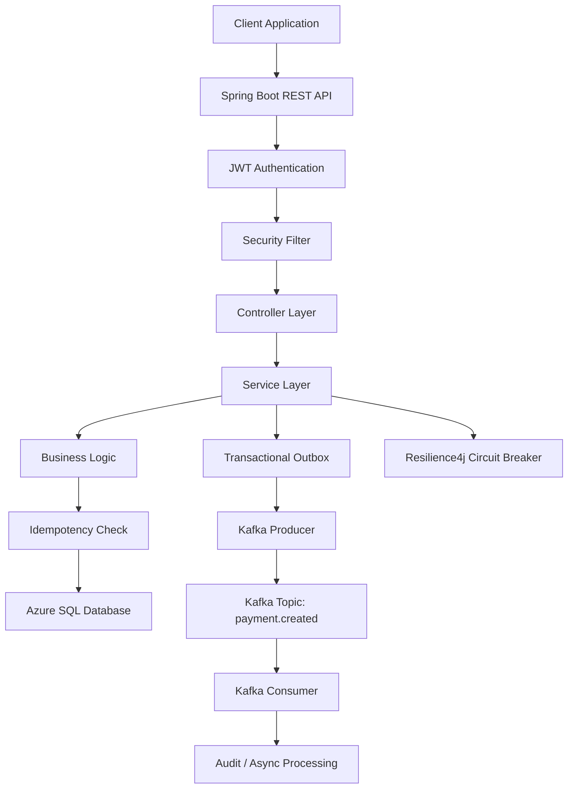

# Payment Microservice – Cloud Native Spring Boot Application

Java | Spring Boot | Kafka | Resilience4j | Azure | Kubernetes | Docker | CI/CD | Design Patterns

---

# Overview

This repository contains a cloud-native Payment microservice built using Spring Boot and designed for deployment on Microsoft Azure.

It demonstrates modern backend engineering practices including:

- Secure REST APIs with JWT authentication
- Event-driven architecture using Kafka
- Transactional Outbox Pattern for reliable messaging
- Idempotent request handling
- Retry mechanisms for fault tolerance
- Circuit Breaker using Resilience4j
- Docker, Kubernetes, and CI/CD pipelines

---

# Architecture

---

# Tech Stack

## Backend
- Java 21
- Spring Boot 3
- Spring Web
- Spring Data JPA
- Spring Security
- JWT Authentication
- Spring Kafka
- Resilience4j

## Messaging
- Apache Kafka
- Transactional Outbox Pattern

## Cloud
- Microsoft Azure
- Azure App Service
- Azure SQL Database

## Containerization
- Docker

## Orchestration
- Kubernetes

## DevOps
- Azure DevOps Pipelines
- Infrastructure as Code (Bicep)

## Monitoring
- Azure Application Insights
- Azure Log Analytics

---

# Key Features

## Kafka Event-Driven Architecture
- Publishes payment events asynchronously
- Topic: payment.created

## Transactional Outbox Pattern
- Ensures reliable event publishing

## Idempotency
- Prevents duplicate payments

## Retry Handling
- Producer and consumer retry logic

## Circuit Breaker
- Fault tolerance using Resilience4j

---

# Security Components

- SecurityConfig.java
- JWTAuthenticationFilter.java
- JwtConfig.java
- CustomUserDetailsService.java
- JWTUtil.java

---

# API Endpoints

POST /auth/login  
GET /payments  
POST /payments  

---

# Author

Abinaya Suryanarayanan
