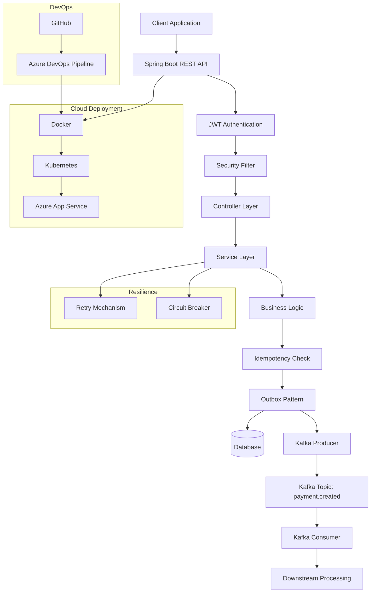

# Payment Microservice – Cloud Native Spring Boot Application

Java | Spring Boot | Kafka | REST API | JWT Security | Resilience4j | Azure | Kubernetes | Docker | CI/CD | Design Patterns

---

# Overview

This repository contains a cloud-native Payment microservice built using Spring Boot and designed for deployment on Microsoft Azure.

The project simulates a production-grade payment processing system and demonstrates how modern backend systems are built using:

- Secure REST APIs with JWT authentication

- Event-driven architecture using Apache Kafka

- Transaction reliability using the Transactional Outbox Pattern

- Idempotent request handling to prevent duplicate payments

- Fault tolerance using Resilience4j (Circuit Breaker & Retry)

- Containerization using Docker and orchestration via Kubernetes

- CI/CD pipelines using Azure DevOps

This project reflects real-world enterprise backend architecture used in banking and fintech systems.

---

# Architecture



---

# Tech Stack

Backend

- Java 21
- Spring Boot 3
- Spring Web
- Spring Data JPA
- Spring Security

Messaging

- Apache Kafka
- Kafka Producer & Consumer APIs

Resilience

- Resilience4j (Circuit Breaker, Retry)

Caching & Rate Limiting

- Redis (Token Bucket Algorithm)

Cloud

- Microsoft Azure
- Azure App Service

Containerization & Orchestration

- Docker
- Kubernetes

DevOps

- Azure DevOps Pipelines
- Infrastructure as Code (Bicep)

Monitoring

- Azure Application Insights
- Azure Log Analytics

---

# Key Features

1. Secure REST APIs (JWT Authentication)

- Stateless authentication using JWT
- Token-based authorization for protected endpoints
- Spring Security filter chain implementation

2. Event-Driven Architecture (Kafka)

- Payment creation triggers an event → payment.created topic
- Producer publishes events reliably
- Consumer processes downstream workflows asynchronously

Benefits:
- Loose coupling
- Scalability
- High throughput

3. Transactional Outbox Pattern
Ensures reliable message delivery without data inconsistency.

Flow:
- Payment saved in DB
- Event stored in Outbox table
- Outbox publisher sends event to Kafka
- Event marked as processed

Why?
- Prevents data loss between DB & Kafka
- Ensures exactly-once behavior (practical)

4. Idempotent Request Handling
Prevents duplicate payment processing.
- Unique request ID (idempotency key)
- Duplicate requests return cached response
- Ensures safe retries from clients

5. Fault Tolerance (Resilience4j)
Circuit Breaker
- Prevents cascading failures
- Opens when downstream service fails repeatedly
Retry Mechanism
- Retries transient failures automatically
Result:
- Improved system stability
- Better user experience

6.Rate Limiting (Redis – Token Bucket Algorithm)

Implemented Redis-based Token Bucket rate limiting to control API traffic and prevent abuse.

How it works:
- Each client is assigned a token bucket
- Tokens are refilled at a fixed rate
- Each API request consumes a token
- Requests are rejected when tokens are exhausted

Why Token Bucket?
- Allows short bursts of traffic
- Ensures steady request rate over time
- Better suited for payment systems compared to fixed window limits

Benefits:
- Protects system from overload
- Prevents abuse and DDoS-like traffic
- Maintains consistent API performance under high load

---

# Security Architecture

Authentication Flow:

Client Request
↓
Authentication Controller
↓
JWT Token Generation
↓
Client Stores Token
↓
Request with Authorization Header
↓
JWT Filter Validation
↓
Access Granted

Header Example:

Authorization: Bearer <JWT_TOKEN>

---

# API Endpoints

Authentication

POST /auth/login

Request:

{
  "username": "user",
  "password": "password"
}

Response:

{
  "token": "JWT_TOKEN"
}

Payment APIs

GET /payments
POST /payments

Requires JWT Token

Triggers Kafka event on creation 

---
## Project Structure

```plaintext
payment-service
│
├── src/main/java/com/example/payment
│   ├── controller        → REST API endpoints
│   ├── service           → Business logic layer
│   ├── repository        → Data access (JPA)
│   ├── entity            → Database entities
│   ├── dto               → Request/Response objects
│   ├── exception         → Global exception handling
│   ├── util              → Utility classes (JWT, helpers)
│   ├── config            → Security, Kafka, Resilience configs, RateLimitConfigs 
│
│   ├── messaging         → Kafka producer & consumer
│   ├── event             → Event models (PaymentCreatedEvent)
│   ├── outbox            → Transactional Outbox implementation
│   ├── idempotency       → Idempotency handling logic
│
│   ├── strategy          → Strategy pattern
│   ├── factory           → Factory pattern
│   ├── decorator         → Decorator pattern
│   ├── observer          → Observer pattern
│   ├── proxy             → Proxy pattern
│   ├── template          → Template pattern
│
│   └── PaymentApplication.java
│
├── src/main/resources
├── src/test/java/com/example/payment
├── k8s/
├── infra/
├── Dockerfile
├── docker-compose.yml
├── pom.xml
├── azure-pipelines.yml
└── README.md
```

# Design Patterns Implemented
- Strategy Pattern → Payment processing logic
- Factory Pattern → Processor creation
- Decorator Pattern → Additional behaviors
- Observer Pattern → Event notifications
- Proxy Pattern → Controlled access
- Template Pattern → Workflow standardization

---
# Docker

Build:
docker build -t payment-service .

Run:
docker run -p 8080:8080 payment-service

---

# Kubernetes Deployment
kubectl apply -f k8s/

Includes:

Deployment

Service

Namespace

Secrets

---
# Azure Deployment

Azure App Service

CI/CD via Azure DevOps

Flow:
Code → Build → Docker → Deploy

---
# Running Locally
mvn clean install
mvn spring-boot:run

URL:
http://localhost:8080

---
# Skills Demonstrated

- Java & Spring Boot backend engineering
- Microservices & REST API design
- Kafka event-driven architecture
- Transactional Outbox Pattern
- Idempotency handling
- Fault tolerance (Resilience4j)
- Rate limiting using Redis (Token Bucket Algorithm)
- Docker & Kubernetes
- Azure cloud deployment
- CI/CD pipelines

---

# Why This Project Matters

This project demonstrates how real-world financial systems are built with:

- Reliability
- Scalability
- Fault tolerance
- Secure communication

It mirrors architecture used in:

-Banking systems
-Payment gateways
-Distributed microservices

---

# Improvements / Future Enhancements

Planned next-level improvements:

Architecture Enhancements

- Introduce Saga Pattern (Orchestration/Choreography)
- Add Dead Letter Queue (DLQ) for Kafka
- Implement Event versioning & schema registry

Observability

- Distributed tracing (OpenTelemetry / Zipkin)
- Centralized logging (ELK stack)
- Metrics dashboard (Prometheus + Grafana)

Performance & Scalability

- Kafka partition tuning
- Horizontal pod autoscaling (HPA)
- Redis caching layer

Security

- OAuth2 integration
- Role-based access control (RBAC)
- API rate limiting

Testing

- Contract testing
- Integration testing with Testcontainers
- Chaos engineering
- 
---

# Author

Abinaya Suryanarayanan
